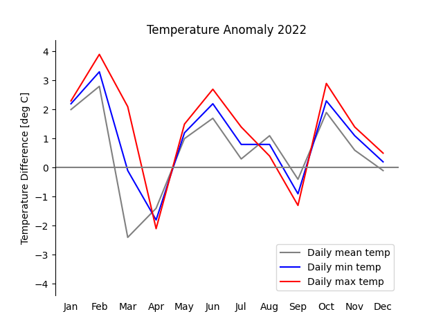

[](https://www.python.org/)
[](https://sqlite.org/)
[](LICENSE)

# Weather Station Database — Data Management Project

An academic group project completed as part of the **Digital Science Minor** at the University of Innsbruck.

## Overview

This project retrieves, processes, and analyzes meteorological data from weather stations across Austria using a public meteo API. The core focus areas are:

- **XML data processing** — parsing station metadata and observation records from XML API responses using Python's `xml.etree.ElementTree`
- **SQL / relational data management** — storing and querying the processed data in a SQLite database with proper schema design, foreign key constraints and correct use of relational databases.

## Project Structure

```
src/
  retrieve_data.py   # Fetches and parses XML data from the meteo API
  database.py        # Manages the SQLite database (schema, inserts, queries)
  graphics.py        # Data retrieval, processing & analysis
data/                # Generated SQLite database
images/              # Plotted data
```

## Results

|                                          Min Temperature                                           |                                          Max Temperature                                           |                                          Mean Temperature                                           |
| :------------------------------------------------------------------------------------: | :------------------------------------------------------------------------------------: | :------------------------------------------------------------------------------------: |
|  |  |  |

|                                  High Altitude Stations                                  |                                 Low Altitude Stations                                  |
| :--------------------------------------------------------------------------------------: | :------------------------------------------------------------------------------------: |
|  |  |

|                     Temperature Anomaly                     |
| :--------------------------------------------------------------: |
|  |
